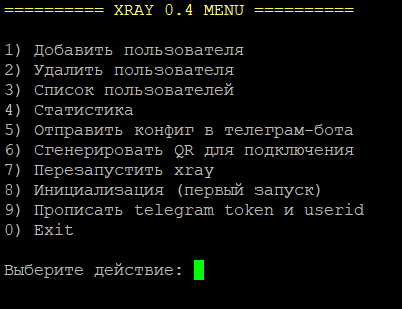
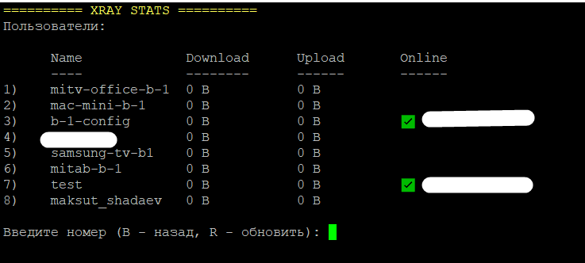

# Xray Account Manager — лаконичный и удобный интерфейс управления пользователями Xray (Reality)

Xray Manager даёт понятное меню, быстрые действия и
аккуратную статистику. Подходит для ежедневной работы без лишней ручной
возни в конфиге.

Что умеет
- Меню управления: добавление, удаление, список пользователей, рестарт, статистика
- Инициализация Xray: генерация Reality ключей и базового конфига
- Безопасное создание пользователей: UUID, конфиг клиента и ссылка подключения
- QR код и VLESS линк в один шаг
- Отправка конфигурации в Telegram (сообщение/файл через Bot API)
- Статистика по каждому пользователю (uplink / downlink / total) с удобной навигацией
- Табличные списки: имена и UUID читаются без «каши» в консоли

Особенности
- Реальные параметры Reality (SNI, shortId, ключи) подставляются автоматически
- Данные статистики берутся через Xray API (statsquery)
- Всё в одном файле

Как пользоваться
- Запуск без аргументов открывает меню
- Для автоматизации доступны CLI команды (init, add, list, remove, stat, и др.)

Кому подойдёт
- Тем, кто управляет небольшим числом пользователей и хочет порядок
- Тем, кто предпочитает простую и понятную работу через меню

## Скриншоты

### Главное меню


### Добавление пользователя


### Добавление пользователя


### Статистика



# XRAY Account Manager

## Установка

### Шаг 1: Установить Git
```bash
sudo dnf install git -y
```

Проверка установленной версии
```bash
git --version
```

### Шаг 2: Клонировать репозиторий:
```bash
git clone https://github.com/lencleya/xray-account-manager.git && cd xray-account-manager
```
Все файлы будут скопированы на сервер.

### Шаг 3: Дать права на выполнение скриптов:
```bash
chmod +x install.sh && chmod +x uninstall.sh && chmod +x xray-manager.sh
```
Это необходимо, чтобы запускать скрипты 

### Шаг 4: Запустить установку:
```bash
sudo ./install.sh
```
Скрипт:
- создаст необходимые директории
- установит Xray
- проверит зависимости (curl, jq, qrencode и др.)
- подготовит конфиги для работы

Обновление
----------

Чтобы обновить версию с GitHub:

```bash
cd xray-account-manager
```
```bash
git pull
```
После этого подтянется последняя версия скриптов и конфигов.
При необходимости можно заново запускать:
```bash
./install.sh
```
чтобы обновить конфиги или сам менеджер.

### Удаление

Для удаления xray запустите команду:
```bash
bash -c "$(curl -L https://github.com/XTLS/Xray-install/raw/main/install-release.sh)" @ remove
```

Для удаления xray-manager выполните команду:
```bash
sudo ./uninstall.sh
```


